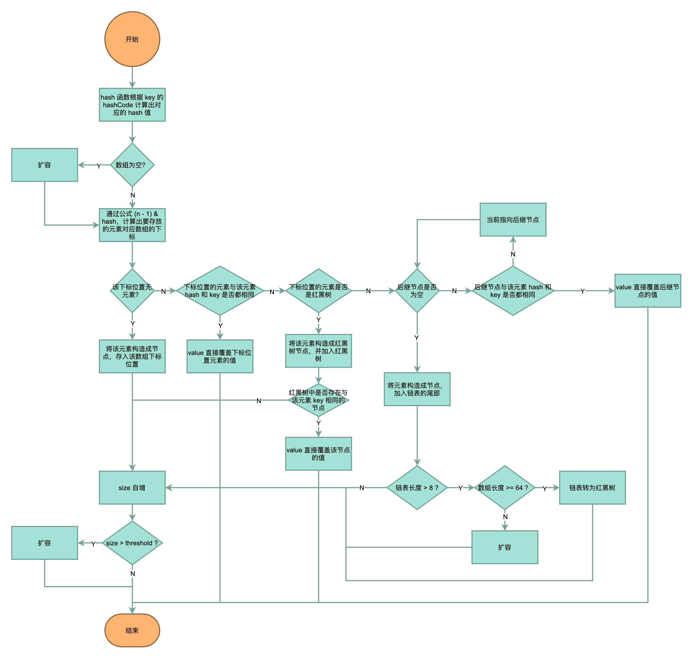

## put 方法



```java
public V put(K key, V value) {
    // 根据 key 的 hashCode 计算出对应的 hash 值，带入 putVal 方法
    return putVal(hash(key), key, value, false, true);
}

/**
 * 扰动函数，减少 hash 碰撞
 */
static final int hash(Object key) {
    int h;
    // ^：按位异或（不同为 1，相同为 0）
    // >>>：无符号右移，忽略符号位，空位补 0
    return (key == null) ? 0 : (h = key.hashCode()) ^ (h >>> 16);
}

final V putVal(int hash, K key, V value, boolean onlyIfAbsent,
                boolean evict) {
    Node<K,V>[] tab; Node<K,V> p; int n, i;
    // 数组为空吗？
    if ((tab = table) == null || (n = tab.length) == 0)
        // 扩容
        n = (tab = resize()).length;
    // 通过公式 (n - 1) & hash 计算要存放的元素对应的数组下标
    if ((p = tab[i = (n - 1) & hash]) == null)
        // 若该下标位置没有元素，则将该元素构造成节点，存入该数组下标位置
        tab[i] = newNode(hash, key, value, null);
    else {
        // 该下标位置有元素
        Node<K,V> e; K k;
        // 如果待存放元素与下标位置元素的 key 相同，则直接覆盖该位置的 value 值
        if (p.hash == hash &&
            ((k = p.key) == key || (key != null && key.equals(k))))
            e = p;
        // 如果下标位置的元素是一棵红黑树，则将该元素加入红黑树
        else if (p instanceof TreeNode)
            e = ((TreeNode<K,V>)p).putTreeVal(this, tab, hash, key, value);
        // 如果下标位置的元素是一个链表
        else {
            // 遍历链表
            for (int binCount = 0; ; ++binCount) {
                if ((e = p.next) == null) {
                    // 如果后继节点为空，则将元素构造成节点，加入链表的尾部
                    p.next = newNode(hash, key, value, null);
                    // 当链表长度 > 8 时，考虑是否要将链表转化为红黑树，以提高元素查找效率
                    if (binCount >= TREEIFY_THRESHOLD - 1) // -1 for 1st
                        treeifyBin(tab, hash);
                    break;
                }
                // 如果待存放元素与后继节点的 key 相同，则直接覆盖后继节点的 value 值
                if (e.hash == hash &&
                    ((k = e.key) == key || (key != null && key.equals(k))))
                    break;
                // 当前指向后继节点
                p = e;
            }
        }
        if (e != null) { // existing mapping for key
            V oldValue = e.value;
            if (!onlyIfAbsent || oldValue == null)
                e.value = value;
            afterNodeAccess(e);
            return oldValue;
        }
    }
    ++modCount;
    // size 自增后，若 > 阈值，则扩容
    if (++size > threshold)
        resize();
    afterNodeInsertion(evict);
    return null;
}
```