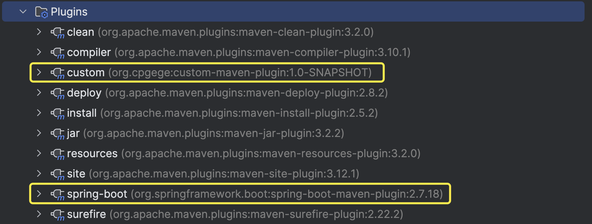
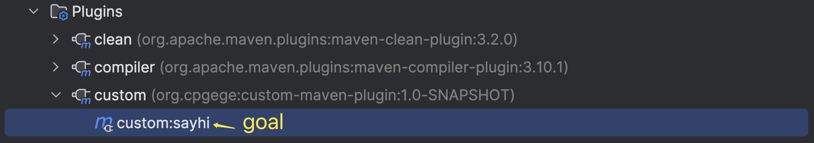
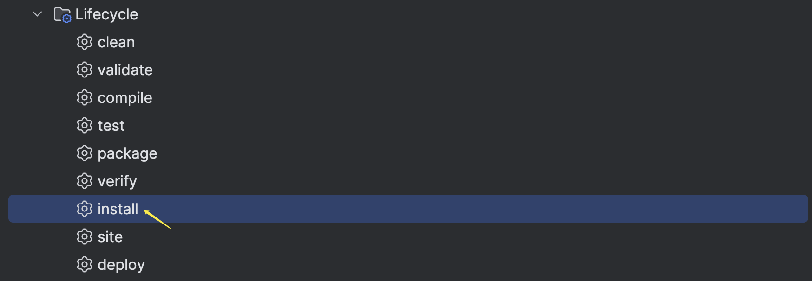

## Maven 插件命名规范

Maven 官方维护的插件通常以 `maven-<yourplugin>-plugin` 格式命名。如果你自己想开发一个插件，必须遵循 `<yourplugin>-maven-plugin` 格式。



IDEA 中打开 Maven 面板，可以看到项目中依赖的 Maven 插件，其中圈出来的是非官方的插件，也就是我们的自定义插件。

## 什么是 Mojo

> Mojo 就是 `Maven Ordinary Java Object`。每一个 Mojo 对应 Maven 中的一个执行目标（`executable goal`），而插件则是对单个或多个相关的 Mojo 做统一分发。一个 Mojo 包含一个简单的 Java 类。插件中多个类似 Mojo 的通用之处可以使用抽象父类来封装。



### 一个简单的 Mojo 示例

```java
package org.cpgege.plugin;

import org.apache.maven.plugin.AbstractMojo;
import org.apache.maven.plugin.MojoExecutionException;
import org.apache.maven.plugin.MojoFailureException;
import org.apache.maven.plugins.annotations.Mojo;

/**
 * sayhi goal
 */
@Mojo(name = "sayhi")
public class GreetingMojo extends AbstractMojo {
    @Override
    public void execute() throws MojoExecutionException, MojoFailureException {
        getLog().info("Hello, world.");
    }
}
```

- 定义一个 Mojo 类，继承 `org.apache.maven.plugin.AbstractMojo`，并实现 `execute` 方法，Maven Goal 在执行时，会调用此方法。
- Mojo 类打上 @Mojo 注解，并指定 `name` 为你要定义的 goal 的名字。

## 创建 Maven 项目，配置 pom 文件

```
.
├── pom.xml
└── src
    └── main
        └── java
            └── org
                └── cpgege
                    └── plugin
                        └── GreetingMojo.java
```

### 项目描述

```xml
<groupId>org.cpgege</groupId>
<!-- 插件的名字 -->
<artifactId>custom-maven-plugin</artifactId>
<!-- 插件的版本 -->
<version>1.0-SNAPSHOT</version>
<!-- packaging 必须设置为 maven-plugin -->
<packaging>maven-plugin</packaging>
```

### 项目依赖

```xml
<properties>
    <maven-plugin-tools.version>3.10.2</maven-plugin-tools.version>
</properties>

<dependencies>
    <!-- 使用 AbstractMojo 类，需要引入 maven-plugin-api -->
    <dependency>
        <groupId>org.apache.maven</groupId>
        <artifactId>maven-plugin-api</artifactId>
        <version>3.9.6</version>
        <scope>provided</scope>
    </dependency>
    <!-- 使用 Mojo 注解，需要引入 maven-plugin-annotations -->
    <dependency>
        <groupId>org.apache.maven.plugin-tools</groupId>
        <artifactId>maven-plugin-annotations</artifactId>
        <version>${maven-plugin-tools.version}</version>
        <scope>provided</scope>
    </dependency>
</dependencies>
```

### 插件依赖

```xml
<build>
    <plugins>
        <plugin>
            <groupId>org.apache.maven.plugins</groupId>
            <artifactId>maven-plugin-plugin</artifactId>
            <version>${maven-plugin-tools.version}</version>
        </plugin>
    </plugins>
</build>
```

## 参照示例，编写一个 Mojo

## 构建 Maven Plugin

你可以将编写好的插件 install 到本地，或者 deploy 到私服。

