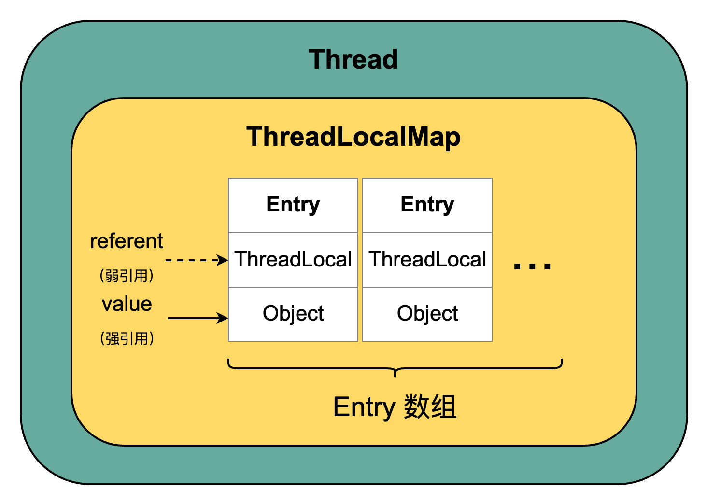

## 线程简介

### 什么是线程

现代操作系统在运行一个程序时，会为其创建一个进程。例如，启动一个 Java 程序，操作系统就会创建一个 Java 进程。线程也叫轻量级进程（`light Weight Process`），是现代操作系统调度的最小单元。在一个进程里可以创建多个线程，处理器在这些线程上高速切换，让使用者感觉到这些线程是在同时执行。

### 为什么要使用多线程

- **充分利用多核处理器和多个 CPU**

使用多线程技术，将计算逻辑分配到多个处理器核心上，就会显著减少程序的处理时间，并且随着更多处理器核心的加入而变得更有效率。

- **更快地响应时间**

响应用户请求的线程能够尽可能快地处理完成，缩短了响应时间，提升了用户体验。

- **好的编程模型，使开发人员更专注于问题的解决**

Java 为多线程编程提供了良好、考究并且一致的编程模型，使开发人员能够更加专注于问题的解决。

### 线程的状态


### Daemon 线程

Daemon 线程是一种支持型线程，因为它主要被用作程序中后台调度以及支持性工作。这意味着，**当一个 Java 虚拟机中不存在非 Daemon 线程的时候，Java 虚拟机将会退出**。可以通过调用 Thread.setDaemon(true) 将线程设置为 Daemon 线程。

```java
public class Daemon {
    public static void main(String[] args) {
        Thread thread = new Thread(new DaemonRunner(), "DaemonRunner");
        thread.setDaemon(true);
        thread.start();
        // main 方法执行完毕，此时没有非守护线程，虚拟机退出
    }

    static class DaemonRunner implements Runnable {
        @Override
        public void run() {
            try {
                SleepUtils.second(10);
            } finally {
                // finally 块中的代码并没有执行
                System.out.println("DaemonThread finally run.");
            }
        }
    }
}
```

::: warning

- Daemon 属性需要在启动线程之前设置，不能在启动线程之后设置。
- 在构建 Daemon 线程时，不能依靠 finally 块中的内容来确保执行关闭或清理资源的逻辑。

:::

## 线程间通信

先来看一个多线程同时修改共享变量的案例：

```java
public class Counter {

    private int count = 0;

    public void increment() {
        count++;
    }

    public int getCount() {
        return count;
    }

    public static void main(String[] args) {
        Counter counter = new Counter();

        Thread thread1 = new Thread(() -> {
            for (int i = 0; i < 100000; i++) {
                counter.increment();
            }
        }, "thread-1");

        Thread thread2 = new Thread(() -> {
            for (int i = 0; i < 100000; i++) {
                counter.increment();
            }
        }, "thread-2");

        thread1.start();
        thread2.start();

        try {
            // 等待 thread1 执行完，才返回
            thread1.join();
            thread2.join();
        } catch (InterruptedException e) {
            throw new RuntimeException(e);
        }

        System.out.println(counter.getCount());
    }
}
```

运行结果：

```text
138076
```

我们期望的是，在对共享变量 count 进行 200000 次累加后，结果会变成 200000，而实际每次执行的结果都不一样，且都小于我们的期望值。

如何避免多线程同时修改共享变量而导致的数据不一致问题呢？这里我们对 increment() 方法加上 synchronized 关键字：

```java
public synchronized void increment() {
    count++;
}
```

运行结果：

```text
200000
```
::: tip synchronized

synchronized 关键字能够确保同一时刻只能有一个线程处于同步块或同步方法中，从而保证了一个线程对共享变量的修改对另一个线程可见。

:::

### 线程访问同步块的过程

```java
Object object = new Object();
synchronized (object) {
    // do something
}
```


任意线程对 Object（Object 由 synchronized 保护）的访问，首先要获得 Object 的监视器。如果获取失败，线程进入同步队列，线程状态变为 BLOCKED。当访问 Object 的前驱（获得了锁的线程）释放了锁，则该释放操作唤醒阻塞在同步队列中的线程，使其重新尝试对监视器的获取。

### 等待 / 通知机制


::: warning 调用 wait()、notify() 及 notifyAll() 时注意细节

1. 使用 wait()、notify() 和 notifyAll() 时，需要**先对调用对象加锁**。

2. 调用 wait() 方法后，线程状态由 RUNNING 变为 WAITING，并将当前线程放置到对象的等待队列。

3. notify() 或 notifyAll() 方法调用后，等待线程依旧不会从 wait() 返回，需要调用 notify() 或 notifAll() 的线程释放锁之后，等待线程才**有机会**从 wait() 返回。

4. **notify() 方法将等待队列中的一个等待线程从等待队列中移到同步队列中，而 notifyAll() 方法则是将等待队列中所有的线程全部移到同步队列**，被移动的线程状态由 WAITING 变为 BLOCKED。

5. **从 wait() 方法返回的前提是获得了调用对象的锁**。

:::


### 等待 / 通知的经典范式

等待方：
```java
synchronized (对象) {
    while (条件不满足) {
        对象.wait();
    }
    对应的处理逻辑
}
```

通知方：
```java
synchronized (对象) {
    改变条件
    对象.notifyAll();
}
```

### thread.join() 的使用

如果一个线程 A 执行了 thread.join() 语句，其含义是：当前线程 A 等待 thread 线程终止之后才从 thread.join() 返回。


为了方便记忆，你也可以理解成“**我等你（执行完）**”，源码如下：

```java
/**
 * Waits for this thread to die.
 * （我等你执行完）
 */
public final void join() throws InterruptedException {
    join(0);
}

public final synchronized void join(long millis)
        throws InterruptedException {
    long base = System.currentTimeMillis();
    long now = 0;

    if (millis < 0) {
        throw new IllegalArgumentException("timeout value is negative");
    }

    if (millis == 0) {
        // 你还在执行吗？
        while (isAlive()) {
            // 还在执行的话，那我无限等下去，反正你执行完了会调用自身的 notifyAll() 方法
            // 将我唤醒，此后我将继续前行
            wait(0);
        }
    } else {
        while (isAlive()) {
            long delay = millis - now;
            if (delay <= 0) {
                break;
            }
            wait(delay);
            now = System.currentTimeMillis() - base;
        }
    }
}

```

通过分析 join() 方法的源码，可以发现正好符合“等待 / 通知”经典范式的“等待方”，即：加锁（这里的锁是被执行 join() 方法的线程对象）、条件循环和处理逻辑 3 个步骤。

### ThreadLocal 的使用


想象一下，你是一位宇航员，准备在太空执行一项任务。由于任务不同，每个宇航员都需要准备一套特定的工具，以便在执行各自任务时使用。那么准备好的工具存放在哪里呢？假如只有一个工具箱，大家把工具都放在这个箱子里，用的时候再从箱子里取。这就会带来一个问题，你在执行任务时发现，你取到的是别的宇航员的工具，也就无法完成你手头的任务。最好的办法是，每个宇航员把需要的工具装进自己的“口袋”中，随身携带，用的时候再从口袋中拿，这样就不会引起混乱。

这个比喻中，每个宇航员就相当于一个线程，宇航员身上的每个“口袋”就相当于一个个 ThreadLocal（线程本地变量），通过为每个线程提供专属变量，避免了多线程之间数据共享带来的线程安全问题。

::: tip ThreadLocal

ThreadLocal，即线程本地变量，是一个**以 ThreadLocal 对象为键、任意对象为值**的存储结构。这个结构被附带在线程上，也就是说一个线程可以根据一个 ThreadLocal 对象查询到绑定在这个线程上的一个值。

:::

下面通过一个实际开发中可能会碰到的例子展开讲讲 ThreadLocal 的使用场景。

Web 应用中的每个请求可能是由不同用户发起的。在整个请求链路中，可能存在某些方法，需要使用用户信息。为了避免将用户信息作为参数层层传递，我们可以在请求一开始将用户信息获取并存入线程的“口袋”，在请求过程中，随时取用“口袋”中的用户信息，在请求结束时，清空“口袋”。由于每个线程都有自己的专属“口袋”，就不存在线程安全问题。

**Step1. 编写账户信息存取工具**

```java
/**
 * 账户信息存取工具
 */
public class AccountHolder {

    private AccountHolder() {
    }

    /**
     * 存放账户信息的线程本地变量
     */
    private static final ThreadLocal<Account> ACCOUNT_THREAD_LOCAL = new ThreadLocal<>();

    /**
     * 获取账户信息
     *
     * @return 当前线程上存放的账户信息
     */
    public static Account getAccount() {
        return ACCOUNT_THREAD_LOCAL.get();
    }

    /**
     * 存放账户信息
     *
     * @param account
     */
    public static void setAccount(Account account) {
        ACCOUNT_THREAD_LOCAL.set(account);
    }

    /**
     * 将账户信息从当前线程的 ThreadLocalMap 中移除
     */
    public static void clear() {
        ACCOUNT_THREAD_LOCAL.remove();
    }
}
```

**Step2. 编写拦截器，在请求开始和结束处分别执行“设置账户信息”和“移除当前线程中账户信息”操作**

```java
/**
 * 安全校验拦截器
 */
@Configuration
@RequiredArgsConstructor
public class SecurityInterceptor extends HandlerInterceptorAdapter {

    private static final String API_TOKEN = "X-Api-Token";

    private final RedisUtil redisUtil;

    @Override
    public boolean preHandle(HttpServletRequest request, HttpServletResponse response, Object handler)
            throws Exception {
        // token 校验
        String token = request.getHeader(API_TOKEN);
        if (StringUtils.isBlank(token)) {
            throw new AuthException(AuthError.PARAM_INVALID, "token为空");
        }

        // 获取登录者账户信息
        String accountInfoStr = redisUtil.get(ManagerCacheKeyEnum.LOGIN_TOKEN.getKey(token));
        if (StringUtils.isBlank(accountInfoStr)) {
            throw new AuthManagerException(AuthManagerError.API_TOKEN_NOT_EXISTS);
        }

        Account account = JSON.parseObject(accountInfoStr, Account.class);

        // 设置登录者账户信息
        AccountHolder.setAccount(account);

        return true;
    }

    @Override
    public void afterCompletion(HttpServletRequest request, HttpServletResponse response, Object handler, Exception ex) throws Exception {
        // 移除当前线程中账户信息
        AccountHolder.clear();
    }
}
```

**Step3. 在请求链路中取用账户信息**

```java
/**
 * Role Controller
 */
@RestController
@RequestMapping("role")
@RequiredArgsConstructor
public class RoleController {

    private final RoleService roleService;

    @PostMapping("add")
    public DataResponse<Role> add(@RequestBody RoleAddRequest roleAddRequest) {
        RoleAddBO roleAddBO = roleAddRequest.toBean(RoleAddBO.class);
        // 获取账户信息
        Account account = AccountHolder.getAccount();
        roleAddBO.setCreatorId(account.getId());
        roleAddBO.setCreatorName(account.getNickname());
        return DataResponse.ok(roleService.addRole(roleAddBO));
    }
}
```

#### ThreadLocal 内部结构



我们通过源码了解一下 ThreadLocal 的具体结构。为了阅读方便，此处省略了部分源码。

Thread 源码摘要：

```java
public
class Thread implements Runnable {
    
    /* ThreadLocal values pertaining to this thread. This map is maintained
     * by the ThreadLocal class. */
    ThreadLocal.ThreadLocalMap threadLocals = null;

}
```

ThreadLocal 源码摘要：

```java
public class ThreadLocal<T> {
    
    /**
     * ThreadLocalMap is a customized hash map suitable only for
     * maintaining thread local values. No operations are exported
     * outside of the ThreadLocal class. The class is package private to
     * allow declaration of fields in class Thread.  To help deal with
     * very large and long-lived usages, the hash table entries use
     * WeakReferences for keys. However, since reference queues are not
     * used, stale entries are guaranteed to be removed only when
     * the table starts running out of space.
     */
    static class ThreadLocalMap {

        /**
         * The entries in this hash map extend WeakReference, using
         * its main ref field as the key (which is always a
         * ThreadLocal object).  Note that null keys (i.e. entry.get()
         * == null) mean that the key is no longer referenced, so the
         * entry can be expunged from table.  Such entries are referred to
         * as "stale entries" in the code that follows.
         */
        static class Entry extends WeakReference<ThreadLocal<?>> {
            /** The value associated with this ThreadLocal. */
            Object value;

            Entry(ThreadLocal<?> k, Object v) {
                super(k);
                value = v;
            }
        }

        /**
         * The initial capacity -- MUST be a power of two.
         */
        private static final int INITIAL_CAPACITY = 16;

        /**
         * The table, resized as necessary.
         * table.length MUST always be a power of two.
         */
        private Entry[] table;

        /**
         * Construct a new map initially containing (firstKey, firstValue).
         * ThreadLocalMaps are constructed lazily, so we only create
         * one when we have at least one entry to put in it.
         */
        ThreadLocalMap(ThreadLocal<?> firstKey, Object firstValue) {
            table = new Entry[INITIAL_CAPACITY];
            int i = firstKey.threadLocalHashCode & (INITIAL_CAPACITY - 1);
            table[i] = new Entry(firstKey, firstValue);
            size = 1;
            setThreshold(INITIAL_CAPACITY);
        }
    }
}
```

每个线程都有一个 ThreadLocalMap，用来存放与该线程相关的本地变量的值，这个 Map 是由 Entry 数组组成的，每个 Entry 包含了一个指向 ThreadLocal 对象的**弱引用**（WeakReference）和一个指向 Object 对象的强引用。**仅被弱引用关联的对象只能生存到下一次垃圾收集发生为止**，而无论何种情况下，垃圾收集器永远不会回收掉被强引用关联的对象。也就是说，如果 ThreadLocal 对象不存在额外的强引用，那么下一次垃圾收集发生时，该 ThreadLocal 对象会被清理掉，而对应的 value 则不会被清理。这样一来，ThreadLocalMap 中就会出现 key 为 null 的 Entry，这些 Entry 将不再被使用，应该被垃圾收集器回收。

ThreadLocalMap 提供了 expungeStaleEntry(int staleSlot) 方法，专门用于清理过时 Entry（key 为 null 的 Entry）。`java.lang.ThreadLocal.ThreadLocalMap#expungeStaleEntry` 源码如下：

```java
private int expungeStaleEntry(int staleSlot) {
    Entry[] tab = table;
    int len = tab.length;

    // expunge entry at staleSlot
    tab[staleSlot].value = null;
    tab[staleSlot] = null;
    size--;

    // Rehash until we encounter null
    Entry e;
    int i;
    for (i = nextIndex(staleSlot, len);
            (e = tab[i]) != null;
            i = nextIndex(i, len)) {
        ThreadLocal<?> k = e.get();
        if (k == null) {
            e.value = null;
            tab[i] = null;
            size--;
        } else {
            int h = k.threadLocalHashCode & (len - 1);
            if (h != i) {
                tab[i] = null;

                // Unlike Knuth 6.4 Algorithm R, we must scan until
                // null because multiple entries could have been stale.
                while (tab[h] != null)
                    h = nextIndex(h, len);
                tab[h] = e;
            }
        }
    }
    return i;
}
```

::: tip 清理过时 Entry 的时机

- `java.lang.ThreadLocal#set`：调用此方法，为 ThreadLocalMap 设置新的 ThreadLocal 时，会清理过时 Entry。
- `java.lang.ThreadLocal#get`：调用此方法，有可能会触发过时 Entry 的清理。
- `java.lang.ThreadLocal#remove`：调用此方法，除了会删除当前 ThreadLocal 对应的 Entry，也会清理过时 Entry。

:::

想象一下这个过程：
`1. 创建 ThreadLocal 对象并使用` -> `2. 解除 ThreadLocal 对象强引用（此时并未调用 remove 方法），ThreadLocal 只剩弱引用` -> `3. 发生 GC` -> `4. ThreadLocal 对象被清理，对应的 value 存活` -> `5. 新的 ThreadLocal 添加到了 ThreadLocalMap` -> `6. 触发“过时 Entry 清理”，避免内存泄漏`

如果 Entry 的 key 被设计成强引用，那么第二步中，ThreadLocal 对象的强引用依然存在，即使发生了 GC，只要线程还存活，ThreadLocal 对象和对应的 value 都不会被回收（因为不满足“过时 Entry 清理”的条件：key 为 null 的 Entry 才会被清理）。这也是 Entry 的 key 被设计成弱引用的原因，这种设计**有助于避免潜在的内存泄漏**。

虽然“过时 Entry 清理”机制能在一定程度上避免潜在的内存泄漏，但需满足一定条件才能触发。考虑到线程池中的线程会被重复利用，这种情况下，线程一般都有较长的生命周期，如果不满足触发条件，这些 key 为 null 的 value 将会常驻内存，进而引发内存泄漏。

为杜绝这种情况的发生，使用 ThreadLocal 时，一定要养成良好的习惯：

::: warning 规范使用 ThreadLocal

每次用完 ThreadLocal，都调用其 remove() 方法，及时清理对应的 Entry，从而有效避免内存泄漏。

:::

<Share colorful services="qrcode,telegram,twitter" />