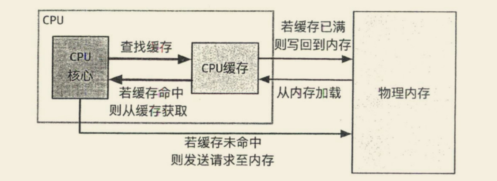
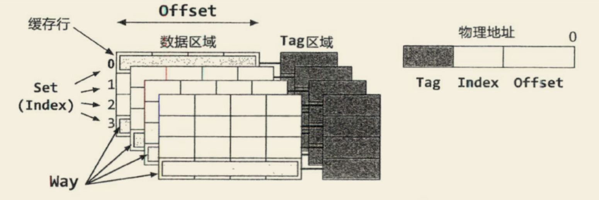

在多线程并发编程中，volatile [/ˈvɒlətaɪl/] 和 synchronized 扮演着重要的角色。在多核处理器中，volatile 保证了共享变量的**可见性**，当一个线程修改共享变量时，另一个线程能够立即读取到修改后的值。在了解其实现原理之前，我们有必要了解一下 CPU 缓存相关知识。

## 物理内存与 CPU 缓存

CPU 在执行过程中，可以通过**访存指令**向物理内存中写入数据或者从其中读取数据。CPU 使用物理内存的方式很简单：通过总线向物理内存发送一个读写请求，其中包括**目标地址**（若是写请求，则还包括写入值），物理内存在收到请求后进行读写操作（若是读请求，则将读取值发送回 CPU）。因此从 CPU 的角度，可以把物理内存看作由字节组成的大数组：其中每一个字节拥有一个地址（物理地址），CPU 可以在这个数组中存取数据。

然而，相比于 CPU 处理的速度，内存访问速度是非常缓慢的：一条算术运算指令可能只需要一个或几个时钟周期即可完成，而一次内存的访问则可能需要花费上百个时钟周期。为了降低 CPU 访存的开销，现在的 CPU 中通常引入了缓存（cache），用于存放一部分物理内存中的数据。访问 CPU 缓存比访问物理内存要快很多，一般最快只需要几个时钟周期。当 CPU 需要向物理内存写入数据的时候，它可以直接写在 CPU 缓存之中；当 CPU 需要从物理内存读取数据的时候，它可以先在 CPU 缓存中查找，如果没找到再去物理内存中获取，并且把取回的数据放入缓存中，以便加快下次读取速度。

### 缓存结构

CPU 缓存是由若干个缓存行（`cache line`）组成的。每个缓存行包括：一个有效位（`valid bit`），用于表示其是否有效；—个标记地址（`tag address`），用于标识其对应的物理地址；一些其他的状态信息。通常，CPU 以缓存行（常见的是 64 字节）为单位把物理内存中的数据读取到 CPU 缓存中，也就是说即使只需要单个字节的值，该字节对应的缓存行也会全部进入缓存中。同样，将数据写回到物理内存也是以缓存行为单位的。

为了通过内存的物理地址找到对应的缓存，物理地址在逻辑上分为 Tag、Set（也称为 Index）以及 Offset 三段。组（Set）与路（Way）是 CPU 缓存的经典概念。物理地址中的 Set 段能表示的最大数目称为组。例如，如果 Set 段的位数是 8，那么对应的 CPU 缓存的组数就是 256（$2^8 = 256$）。同一组（即 Set 段相等）下，支持的最大 Tag 数则称为路，即同一组下的缓存行数目。例如上图中，在 Set 相同的情况下，缓存最多支持 4 个不同的 Tag，也就是 4 路，该 CPU 缓存被称为 4 路组相联（4-Way Set Associative）。

## volatile 的实现原理

> 如果一个字段被声明成 volatile，Java 线程内存模型确保所有线程看到这个变量的值是一致的。