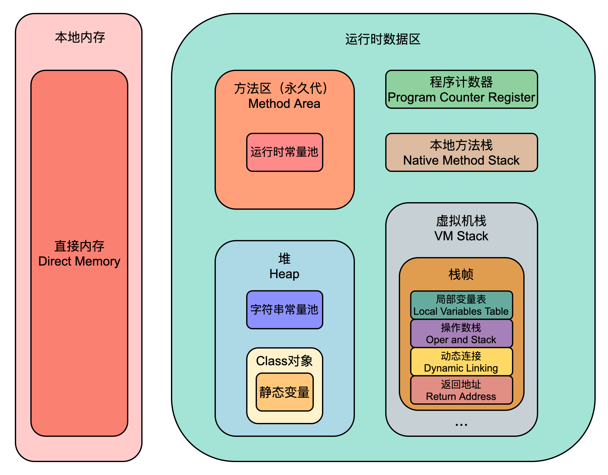
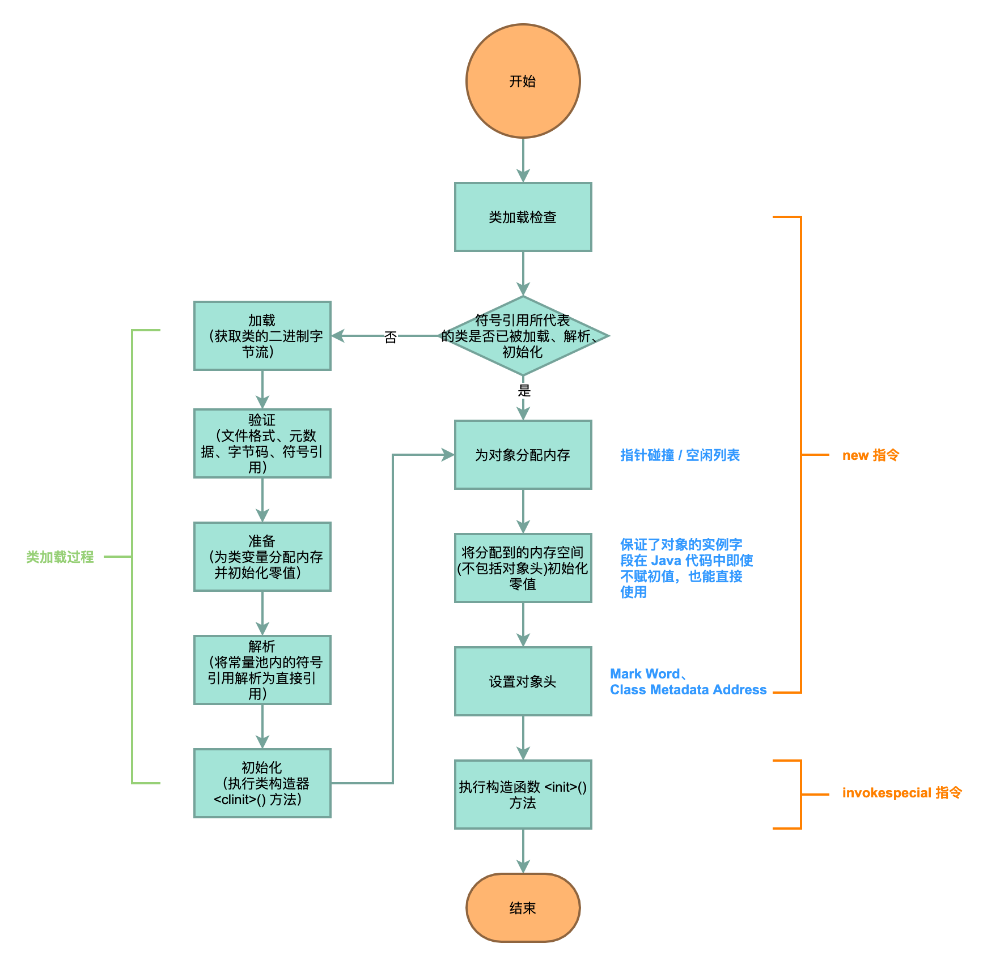

## JVM 内存区域

Java 虚拟机在执行 Java 程序的过程中会把它所管理的内存划分为若干个不同的数据区域。

::: info JDK 6

JDK 6 及之前的版本，字符串常量池和静态变量都在永久代。

:::

::: tip JDK 7

JDK 7 开始，字符串常量池和静态变量移到了堆中。

:::

::: tip JDK 8

到了 JDK 8，废弃了永久代的概念，改用在本地内存中实现的元空间（Metaspace）来代替，把 JDK 7 中永久代还剩余的内容（主要是类型信息）全部移到元空间中。

:::

### 程序计数器

程序计数器（`Program Counter Register`）是一块较小的内存空间，它可以看作是当前线程所执行的字节码的**行号指示器**。**线程私有**。此内存区域是唯一一个在《Java 虚拟机规范》中没有规定任何 OutOfMemoryError 情况的区域。

### Java 虚拟机栈

Java 虚拟机栈（Java Virtual Machine Stack）也是**线程私有**的，它的生命周期与线程相同。虚拟机栈描述的是 Java 方法执行的线程内存模型：每个方法被执行的时候，Java虚拟机都会同步创建一个栈帧（`Stack Frame`）用于存储**局部变量表、操作数栈、动态连接、方法出口**等信息。每一个方法被调用直至执行完毕的过程，就对应着一个栈帧在虚拟机栈中从入栈到出栈的过程。

- 局部变量表存放了编译期可知的各种 Java 虚拟机**基本数据类型**（boolean、byte、char、short、int、float、long、double）、**对象引用**（reference 类型，它并不等同于对象本身，可能是一个指向对象起始地址的引用指针，也可能是指向一个代表对象的句柄或者其他与此对象相关的位置）和 **returnAddress 类型**（指向了一条字节码指令的地址）。

- 动态连接是一个指向运行时常量池中该**栈帧所属方法的引用**。

- 方法返回地址，便于被调方法退出后，能够返回到最初被调用时的位置。

::: tip 《Java 虚拟机规范》对 Java 虚拟机栈规定的异常情况

- 如果线程请求的栈深度大于虚拟机所允许的深度，将抛出 StackOverflowError 异常;
- 如果 Java 虚拟机栈容量可以动态扩展（HotSpot 虚拟机的栈容量是不可以动态扩展的），当栈扩展时无法申请到足够的内存会抛出 OutOfMemoryError 异常。

:::

### 本地方法栈

本地方法栈（`Native Method Stacks`）与虚拟机栈所发挥的作用是非常相似的，其区别只是虚拟机栈为虚拟机执行Java方法（也就是字节码）服务，而本地方法栈则是为虚拟机使用到的本地（Native）方法服务。

::: tip 《Java 虚拟机规范》对本地方法栈规定的异常情况

与虚拟机栈一样，本地方法栈也会在栈深度溢出或者栈扩展失败时分别抛出 StackOverflowError 和 OutOfMemoryError 异常。

:::

### Java 堆

Java 堆是被所有**线程共享**的一块内存区域，在虚拟机启动时创建。此内存区域的唯一目的就是存放对象实例，Java 世界里“几乎”所有的对象实例都在这里分配内存。

**如果在 Java 堆中没有内存完成实例分配，并且堆也无法再扩展时，Java 虚拟机将会抛出 OutOfMemoryError 异常。**

### 方法区

方法区（Method Area）与 Java 堆一样，是各个**线程共享**的内存区域，它用于存储已被虚拟机加载的类型信息、常量、静态变量（JDK 7 开始，静态变量随着 Class 对象一起存放在 Java 堆中）、即时编译器编译后的代码缓存等数据。这块区域的内存回收主要是针对常量池的回收和类型的卸载。

JDK 8 以前，“永久代”并不等同于方法区，它是方法区的具体实现。JDK 8 开始，“元空间”取代了“永久代”。

::: tip 《Java 虚拟机规范》对方法区规定的异常情况

如果方法区无法满足新的内存分配需求时，将抛出 OutOfMemoryError 异常。

:::

### 运行时常量池

运行时常量池（Runtime Constant Pool）是方法区的一部分。Class 文件中除了有类的版本、字段、方法、接口等描述信息外，还有一项信息是**常量池表**（`Constant Pool Table`），用于存放编译期生成的各种字面量与符号引用，这部分内容将在类加载后存放到方法区的运行时常量池中。

一般来说，**运行时常量池除了存储符号引用外，还会存储由符号引用翻译出来的直接引用**。

常量池可以比作 Class 文件里的资源仓库，主要存放两大类常量：**字面量**和**符号引用**。

既然运行时常量池是方法区的一部分，自然受到方法区内存的限制，**当常量池无法再申请到内存时会抛出 OutOfMemoryError 异常**。

### 直接内存

直接内存（`Direct Memory`）并不是虚拟机运行时数据区的一部分，也不是《Java 虚拟机规范》中定义的内存区域。但是这部分内存也被频繁地使用，而且也可能导致 OutOfMemoryError 异常。

在 JDK 1.4 中新加入了 NIO（New Input/Output）类，引入了一种基于通道（Channel）与缓冲区（Buffer）的 I/O 方式，它可以使用 Native 函数库直接分配堆外内存，然后通过一个存储在 Java 堆里面的 DirectByteBuffer 对象作为这块内存的引用进行操作。

虽然本机直接内存的分配不会受到 Java 堆大小的限制，但既然是内存，肯定还是会受到本机总内存（包括物理内存、SWAP 分区或者分页文件）大小以及处理器寻址空间的限制。

::: warning

当配置虚拟机参数时，**需要结合实际内存和直接内存去设置 -Xmx 等参数信息**。切忌因忽略直接内存，使得各个内存区域总和大于物理内存限制，从而导致动态扩展时出现 OutOfMemoryError 异常。

:::

## 对象的创建

new 一个普通对象，会做那些事呢？Java 编译器会在 new 关键字的地方同时生成两条字节码指令：new 和 `invokespecial <init>()`。

## 对象内存分配方式

### 指针碰撞

假设 Java 堆中内存是绝对规整的，所有被使用过的内存都被放在一边，空闲的内存被放在另一边，中间放着一个指针作为分界点的指示器，那所分配内存就仅仅是把那个指针**向空闲空间方向挪动一段与对象大小相等的距离**，这种分配方式称为“指针碰撞”（`Bump The Pointer`）。

当使用 Serial、ParNew、`Parallel Scavenge`、G1 等不会产生内存碎片的收集器时，系统采用的分配算法是指针碰撞。

### 空闲列表

如果 Java 堆中的内存并不是规整的，已被使用的内存和空闲的内存相互交错在一起，那就没有办法简单地进行指针碰撞了，虚拟机就必须**维护一个列表，记录上哪些内存块是可用的**，在分配的时候从列表中找到一块足够大的空间划分给对象实例，并更新列表上的记录，这种分配方式称为“空闲列表”（`Free List`）。

当使用 CMS 这种基于清除（Sweep）算法的收集器时，理论上就只能采用较为复杂的空闲列表来分配内存。

## 对象的内存布局

在 HotSpot 虚拟机里，对象在堆内存中的存储布局可以划分为三个部分：**对象头（Header）**、**实例数据（Instance Data）**和**对齐填充（Padding）**。

### 对象头

对象头部分包括两类信息。第一类是用于存储对象自身的运行时数据（`Mark Word`），如哈希码（HashCode）、GC分代年龄、锁状态标志、线程持有的锁、偏向线程ID、偏向时间戳等。另外一部分是类型指针（`Class Metadata Address`），即对象指向它的类型元数据的指针，Java 虚拟机通过这个指针来确定该对象是哪个类的实例。

如果对象是一个 Java 数组，那在对象头中还必须有一块用于记录数组长度（`Array Length`）的数据。

### 实例数据

实例数据部分是对象真正存储的有效信息，HotSpot 虚拟机默认的分配顺序为 longs/doubles、ints、shorts/chars、bytes/booleans、oops（Ordinary Object Pointers，OOPs），从以上默认的分配策略中可以看到，**相同宽度的字段总是被分配到一起存放**，在满足这个前提条件的情况下，在父类中定义的变量会出现在子类之前。

### 对齐填充

任何对象的大小都必须是 **8 字节的整数倍**。因此，如果对象实例数据部分没有对齐的话，就需要通过对齐填充来补全。

## 对象的访问定位

### 句柄访问

如果使用句柄访问的话，Java 堆中将可能会划分出一块内存来作为句柄池，reference 中存储的就是对象的**句柄地址**，而句柄中包含了对象**实例数据指针**和**类型数据指针**。

优点：reference 中存储的是**稳定句柄地址**，在对象被移动（垃圾收集时移动对象是非常普遍的行为）时只会改变句柄中的实例数据指针，而 reference 本身不需要被修改。

缺点：相比`直接指针访问`，多一次指针定位的时间开销。

### 直接指针访问

**HotSpot 中访问对象的主要方式是直接指针**。如果使用直接指针访问的话，reference 中存储的就是**对象地址**，如果只是访问对象本身的话，就不需要多一次间接访问的开销。

优点：速度更快，它节省了一次指针定位的时间开销。

## JVM 内存区域 OOM 异常情况

在《Java 虚拟机规范》的规定里，**除了程序计数器**，虚拟机内存的其他几个运行时区域都有可能发生 OutOfMemoryError 异常。

### Java 堆溢出

通过参数 `-XX:+HeapDumpOnOutOfMemoryError` 可以让虚拟机在出现内存溢出异常的时候 Dump 出当前的内存堆转储快照以便进行事后分析。

通过内存映像分析工具（如mat）进行堆转储快照分析：

::: tip

mat 的使用请参考：[内存 dump 分析工具 - mat](./tool-mat.md)

:::

1. 如果是内存泄漏（`Memory Leak`），可进一步通过工具查看泄漏对象到 `GC Roots` 的引用链，根据泄漏对象的类型信息以及它到 `GC Roots` 引用链的信息，一般可以比较准确地定位到这些对象创建的位置。

2. 如果内存中的对象确实都是必须存活的，就代表是内存溢出（`Memory Overflow`），那就应当检查 Java 虚拟机的堆参数（`-Xmx` 与 `-Xms`）设置，与机器的内存对比，看看是否还有向上调整的空间。再从代码上检查是否存在某些**对象生命周期过长**、持有状态时间过长、存储结构设计不合理等情况，尽量减少程序运行期的内存消耗。

### 虚拟机栈和本地方法栈溢出

HotSpot 虚拟机中并**不区分虚拟机栈和本地方法栈**， 栈容量只能由 `-Xss` 参数来设定。

$$
\text{栈的深度} = \frac{\text{栈容量}}{\text{平均每个栈帧的大小}}
$$

栈容量固定的情况下，栈的最大深度与平均每个栈帧的大小成反比。

对于 HotSpot 虚拟机而言，当栈容量无法容纳新的栈帧时，会引发 StackOverflowError 异常。当**创建线程**申请内存时，无法获得足够的内存，会引发 OutOfMemoryError 异常。

创建线程导致内存溢出异常案例：

::: danger 注意

重点提示一下，如果读者要尝试运行上面这段代码，记得要先保存当前的工作，由于在 Windows 平台的虚拟机中，Java 的线程是映射到操作系统的内核线程上，无限制地创建线程会对操作系统带来很大压力，上述代码执行时有很高的风险，可能会由于创建线程数量过多而导致操作系统假死。

:::

### 方法区和运行时常量池溢出

#### 字符串常量池导致的内存溢出异常
在 **JDK 6 或更早之前的 HotSpot 虚拟机中，运行时常量池和字符串常量池都是分配在永久代中**，我们可以通过 `-XX:PermSize` 和 `-XX:MaxPermSize` 限制永久代的大小，即可间接限制其中常量池的容量。我们使用 JDK 6 来运行以下代码。

**自JDK 7起，原本存放在永久代的字符串常量池被移至 Java 堆之中**。

#### 方法区内存溢出异常

方法区的主要职责是用于存放类型的相关信息，如类名、访问修饰符、常量池、字段描述、方法描述等。

填满方法区的方法有：

- JDK 动态代理生成大量动态类
- CGLib 生成大量动态类
- 动态语言（例如 Groovy 等）
- 大量 JSP 或动态产生 JSP 文件的应用（JSP 第一次运行时需要编译为 Java 类）
- 基于 OSGi 的应用（即使是同一个类文件，被不同的加载器加载也会视为不同的类）

::: warning
JDK 8 之前，方法区溢出也是一种常见的内存溢出异常，一个类如果要被垃圾收集器回收，要达成的条件是比较苛刻的。在运行时**经常生成大量动态类**的应用场景里，就应该特别关注这些类的回收状况。
:::

#### JDK 8 以后，HotSpot 对元空间的保护

**在 JDK 8 以后，元空间完全替代了永久代**。在实际应用中，**为了预防大量动态类占用内存空间的情况**，HotSpot 提供了一些参数作为元空间的防御措施，主要包括：

- `-XX:MaxMetaspaceSize`：设置元空间最大值，**默认是 -1，即不限制**，或者说只受限于本地内存大小。
- `-XX:MetaspaceSize`：指定元空间的初始空间大小，以字节为单位，**达到该值就会触发垃圾收集进行类型卸载**，同时收集器会对该值进行调整：
  - 如果释放了大量的空间，就适当降低该值;
  - 如果释放了很少的空间，那么在不超过 `-XX:MaxMetaspaceSize`（如果设置了的话）的情况下，适当提高该值。

### 本机直接内存溢出

直接内存（`Direct Memory`）的容量大小可通过 `-XX:MaxDirectMemorySize` 参数来指定，如果不去指定，则**默认与 Java 堆最大值（由 `-Xmx` 指定）一致**。

由直接内存导致的内存溢出，一个明显的特征是在 **`Heap Dump` 文件中没有明显的异常**，如果读者发现内存溢出之后产生的 **Dump 文件很小**，而程序中又直接或间接**使用了 DirectMemory（典型的间接使用就是 NIO）**，那就可以重点检查一下直接内存方面的原因了。