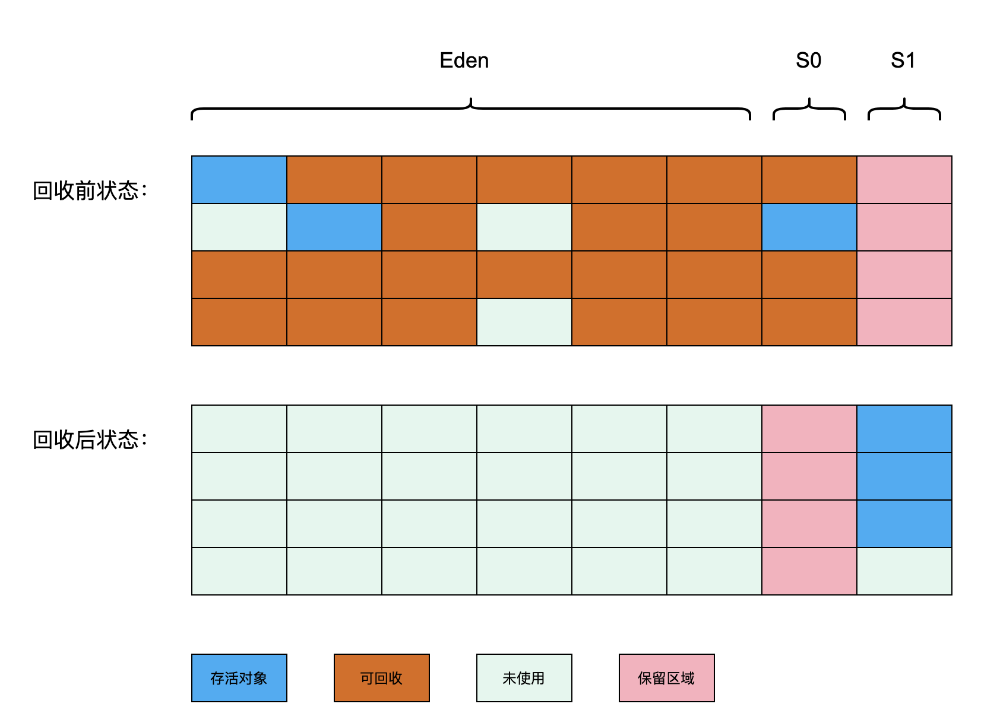

## 判断对象是否存活

### 可达性分析算法

**Java 是通过可达性分析算法来判定对象是否存活的**。通过一系列称为 `GC Roots` 的**根对象**作为起始节点集，从这些节点开始，根据引用关系向下搜索，搜索过程所走过的路径称为“引用链”（`Reference Chain`），**如果某个对象到 `GC Roots` 间没有任何引用链相连，则证明此对象是不可能再被使用的**。

::: tip 哪些对象可以作为 GC Roots

- 虚拟机栈（栈帧中的本地变量表）中引用的对象
- 本地方法栈中 JNI（即通常所说的 Native 方法）引用的对象
- 类静态属性引用的对象
- 常量引用的对象
- 被同步锁（`synchronized` 关键字）持有的对象

:::

## 分代收集理论

### 分代假说

1. 弱分代假说（Weak Generational Hypothesis）：绝大多数对象都是朝生夕灭的。
2. 强分代假说（Strong Generational Hypothesis）：熬过越多次垃圾收集过程的对象就越难以消亡。
3. 跨代引用假说（Intergenerational Reference Hypothesis）：跨代引用相对于同代引用来说仅占极少数。

::: info 分代收集名词定义

- 部分收集（`Partial GC`）：指目标不是完整收集整个 Java 堆的垃圾收集。
  - 新生代收集（`Minor GC` / `Young GC`）：指目标只是新生代的垃圾收集。
  - 老年代收集（`Major GC` / `Old GC`）：指目标只是老年代的垃圾收集。目前只有 CMS 收集器会有单独收集老年代的行为。
  - 混合收集（`Mixed GC`）：指目标是收集整个新生代以及部分老年代的垃圾收集。目前只有 G1 收集器会有这种行为。
- 整堆收集（`Full GC`）：收集整个 Java 堆和方法区的垃圾收集。

:::

## 垃圾收集算法

### 标记-清除算法

标记-清除（`Mark-Sweep`）算法分为“标记”和“清除”两个阶段：首先标记出所有需要回收的对象，在标记完成后，**统一回收掉所有被标记的对象**，也可以反过来，标记存活的对象，统一回收所有未被标记的对象。

主要**缺点**有两个：
1. **执行效率不稳定**，如果 Java 堆中包含大量对象，而且其中大部分是需要被回收的，这时必须进行大量标记和清除的动作，导致标记和清除两个过程的执行效率都随对象数量增长而降低;
2. **内存空间的碎片化问题**，标记、清除之后会产生大量不连续的内存碎片，空间碎片太多可能会导致当以后在程序运行过程中需要分配较大对象时**无法找到足够的连续内存**而不得不**提前触发另一次垃圾收集**动作。

::: warning 新生代不适合用标记-清除算法

新生代大多数对象都是“朝生夕灭”的，使用标记-清除算法时，需要进行大量标记和清除的动作，**效率低**。

:::

### 标记-复制算法

将可用内存按容量划分为大小相等的两块，每次只使用其中的一块。当这一块的内存用完了，就**将还存活着的对象复制到另外一块上面**，然后再把已使用过的内存空间一次性清理掉。

**优点**：**不会产生内存空间碎片**，采用“[指针碰撞](/notes/jvm/chap-one.html#指针碰撞)”分配内存，实现简单，运行**高效**。

**缺点**：将可用内存缩小为原来的一半，**空间浪费严重**。

::: tip 新生代适合用复制算法

标记-复制算法特别适合多数对象可回收的情况，比如新生代的回收，因为需要复制的对象少，**效率高**。

为了减少空间浪费，新生代可以使用改良版的 Appel 式回收。

:::

::: warning 老年代不适合用复制算法

> 标记-复制算法在对象存活率较高时就要进行较多的复制操作，效率将会降低。更关键的是，如果不想浪费 50% 的空间，就需要有额外的空间进行分配担保，以应对被使用的内存中所有对象都 100% 存活的极端情况，所以在老年代一般不能直接选用这种算法。

总结下来有两点：

1. 老年代对象存活率较高，使用复制算法需要进行较多的复制操作，**效率低**。
2. 空间浪费严重，就算使用“Appel 式回收”，也需要有额外的空间进行分配担保，而老年代没有分配担保。

:::

### 复制算法的改良 — Appel 式回收

Appel 式回收的具体做法是把新生代分为一块较大的 Eden 空间和两块较小的 Survivor 空间，每次分配内存只使用 Eden 和其中一块 Survivor。发生垃圾搜集时，**将 Eden 和 Survivor 中仍然存活的对象一次性复制到另外一块 Survivor 空间上**，然后直接清理掉 Eden 和已用过的那块 Survivor 空间。

当 Survivor 空间不足以容纳一次 `Minor GC` 之后存活的对象时，就需要依赖其他内存区域（实际上大多就是老年代）进行**分配担保**（`Handle Promotion`）。

### 标记-整理算法

标记-整理（`Mark-Compact`）算法，其中的标记过程仍然与标记-清除算法一样，但后续步骤不是直接对可回收对象进行清理，而是**让所有存活的对象都向内存空间一端移动**，然后直接清理掉边界以外的内存。

::: info “标记-清除算法”与“标记-整理算法”的异同

**相同点**：`标记-清除算法`与`标记-整理算法`都适用于**老年代**垃圾回收。

**不同点**：
  - `标记-清除算法`是一种**非移动式**的回收算法，因此产生的“内存空间碎片化”问题会导致**内存分配和访问过程变得更为复杂**，最终会影响到用户程序的吞吐量。但是垃圾收集时，**停顿时间会更短**，像关注延迟的 CMS 收集器就是基于`标记-清除算法`的。
  - `标记-整理算法`是**移动式**的，移动存活对象并更新所有引用这些对象的地方，工程量巨大，而且必须暂停用户程序，使得**内存回收更为复杂**。但是规整的内存空间使得**内存分配和访问更容易**，像关注吞吐量的 `Parallel Old` 收集器就是基于`标记-整理算法`的。

:::

## 经典垃圾收集器

### Serial 收集器

Serial 收集器是一个**单线程**工作的**新生代**收集器，但它的“单线程”的意义并不仅仅是说明它只会使用一个处理器或一条收集线程去完成垃圾收集工作，更重要的是强调在它**进行垃圾收集时，必须暂停其他所有工作线程（`Stop The World`），直到它收集结束**。

Serial 收集器对于运行在**客户端模式**下的虚拟机来说是一个很好的选择。

### Serial Old 收集器

`Serial Old` 是 Serial 收集器的**老年代**版本，它同样是一个**单线程**收集器，使用**标记-整理算法**。这个收集器的主要意义也是供客户端模式下的 HotSpot 虚拟机使用。如果在服务端模式下，它也可能有两种用途：一种是在 **JDK 5 以及之前的版本中与 `Parallel Scavenge` 收集器搭配使用**，另外一种就是**作为 CMS 收集器发生失败时的后备预案**，在并发收集发生 `Concurrent Mode Failure` 时使用。

### ParNew 收集器

ParNew 收集器实质上是 **Serial 收集器的多线程并行版本**，除了同时使用多条线程进行垃圾收集之外，其余的行为包括 Serial 收集器可用的所有控制参数、收集算法、`Stop The World`、对象分配规则、回收策略等都与 Serial 收集器完全一致。

ParNew 是 **JDK 7 之前的遗留系统中首选的新生代收集器，能与 CMS 收集器配合工作**。

ParNew 可以说是 HotSpot 虚拟机中**第一款退出历史舞台的垃圾收集器**。

### Parallel Scavenge 收集器

`Parallel Scavenge` 收集器也是一款**新生代**收集器，它同样是基于**标记-复制**算法实现的收集器，也是能够**并行**收集的多线程收集器。

从表面上看和 ParNew 非常相似，但它的关注点与其他收集器不同，CMS 等收集器的关注点是尽可能地缩短垃圾收集时用户线程的停顿时间，`Parallel Scavenge` 收集器的目标则是**达到一个可控制的吞吐量**（Throughput）。

$$
\text{吞吐量} = \frac{\text{运行用户代码时间}}{\text{运行用户代码时间}+\text{运行垃圾收集时间}}
$$

停顿时间越短，越能提高响应速度，从而提升用户体验；而高吞吐量则可以高效地完成运算任务，适合在后台运算而不需要太多交互的分析任务。

::: tip Parallel Scavenge 收集器提供了两个参数用于精确控制吞吐量

- `-XX:MaxGCPauseMillis` 参数允许的值是一个大于 0 的毫秒数，收集器将尽力保证内存回收花费的时间不超过用户设定值。
- `-XX:GCTimeRatio` 参数的值则应当是一个大于 0 小于 100 的整数，其值 $= \frac{\text{用户代码时间}}{\text{垃圾收集时间}}$。

:::

### Parallel Old 收集器

`Parallel Old` 是 `Parallel Scavenge` 收集器的**老年代**版本，支持多线程**并行**收集，基于**标记-整理算法**实现。

在**注重吞吐量**或者处理器资源较为稀缺的场合，都可以优先考虑 `Parallel Scavenge` 加 `Parallel Old` 收集器这个组合。

### CMS 收集器

CMS（`Concurrent Mark Sweep`）收集器是一种以获取**最短回收停顿时间**为目标的收集器，基于**标记-清除算法**实现的。它的运作过程相对于前面几种收集器来说要更复杂一些，整个过程分为四个步骤，包括：

- **初始标记**（`CMS initial mark`）：初始标记仅仅只是标记一下 `GC Roots` 能直接关联到的对象，速度很快。这个阶段**需要停顿线程（STW）**。

- **并发标记**（`CMS concurrent mark`）：并发标记阶段就是从 `GC Roots` 的直接关联对象开始遍历整个对象图的过程，这个过程耗时较长但是不需要停顿用户线程，**可以与垃圾收集线程一起并发运行**。
  
- **重新标记**（`CMS remark`）：重新标记阶段则是为了修正并发标记期间，因用户程序继续运作而导致标记产生变动的那一部分对象的标记记录，这个阶段也**需要停顿线程（STW）**，时间通常会比初始标记阶段稍长一些，但也远比并发标记阶段的时间短。

- **并发清除**（`CMS concurrent sweep`）：清理删除掉标记阶段判断的已经死亡的对象，由于**不需要移动存活对象**，所以这个阶段也是**可以与用户线程同时并发**的。

**优点**：并发收集、**低停顿**

**缺点**：
1. CMS 收集器**对处理器资源非常敏感**，会因为占用了一部分线程，导致应用程序变慢。
2. CMS 收集器**无法处理“浮动垃圾”**，有可能出现“`Concurrent Mode Failure`”失败进而导致另一次完全“`Stop The World`”的 `Full GC` 的产生。
3. CMS 是一款基于“标记-清除”算法实现的收集器，会有大量**空间碎片**产生。

### G1 收集器

G1（`Garbage First`）是一款主要面向**服务端**应用的垃圾收集器。它是垃圾收集器技术发展史上里程碑式的成果，开创了收集器面向**局部收集**的设计思路和基于 **Region** 的内存布局形式。

JDK 9 发布之日，G1 宣告取代 `Parallel Scavenge` 加 `Parallel Old` 组合，成为服务端模式下的默认垃圾收集器，而 CMS 则被声明为不推荐使用（Deprecate）的收集器。

#### G1 设计的目标 —— 建立“停顿时间模型”

> 停顿时间模型（`Pause Prediction Model`）的意思是能够支持指定在一个长度为 M 毫秒的时间片段内，消耗在垃圾收集上的时间大概率不超过 N 毫秒这样的目标。

#### G1 的设计思想

G1 可以选择堆内存任何部分组成回收集（`Collection Set`， 一般简称 CSet），进行回收。哪块内存中存放的垃圾数量最多，回收收益最大，就优先回收哪块内存。这就是 G1 收集器的 `Mixed GC` 模式。

#### G1 的具体实现

G1 把连续的 Java 堆划分为**多个大小相等的独立区域（Region），每一个 Region 都可以根据需要，扮演新生代的 Eden 空间、Survivor 空间，或者老年代空间**。

Region 中还有一类特殊的 Humongous 区域，专门用来存储大对象。G1 认为只要大小超过了一个 **Region 容量一半**的对象即可判定为大对象。每个 Region 的大小可以通过参数 `-XX:G1HeapRegionSize` 设定，取值范围为 **1MB ~ 32MB，且应为 2 的 N 次幂**。而对于那些超过了整个 Region 容量的超级大对象，将会被存放在 N 个连续的 `Humongous Region` 之中，G1 的大多数行为都把 `Humongous Region` 作为老年代的一部分来进行看待。

G1 收集器要怎么做才能满足用户的期望（`-XX:MaxGCPauseMillis`）呢？G1 收集器的停顿预测模型是以衰减均值（Decaying Average）为理论基础来实现的，在垃圾收集过程中，G1 收集器会记录每个 Region 的回收耗时、每个 Region 记忆集里的脏卡数量等各个可测量的步骤花费的成本，并分析得出平均值、标准偏差、置信度等统计信息。然后通过这些信息预测现在开始回收的话，由哪些 Region 组成回收集才可以在不超过期望停顿时间的约束下获得最高的收益。

::: tip

这里强调的“衰减平均值”是指它会比普通的平均值更容易受到新数据的影响，平均值代表整体平均状态，但衰减平均值更准确地代表“**最近的**”平均状态。换句话说，**Region 的统计状态越新越能决定其回收的价值**。

:::

G1 收集器的运作过程大致可划分为以下四个步骤：

- **初始标记**（`Initial Marking`）：仅仅只是标记一下GC Roots能直接关联到的对象，并且修改 TAMS 指针的值，让下一阶段用户线程并发运行时，能正确地在可用的 Region 中分配新对象。这个阶段**需要停顿线程（STW）**，但耗时很短，而且是借用进行 `Minor GC` 的时候同步完成的，所以 G1 收集器在这个阶段实际并没有额外的停顿。

- **并发标记**（`Concurrent Marking`）：从GC Root开始对堆中对象进行可达性分析，递归扫描整个堆里的对象图，找出要回收的对象，这阶段耗时较长，但可**与用户程序并发执行**。当对象图扫描完成以后，还要重新处理 SATB 记录下的在并发时有引用变动的对象。

- **最终标记**（`Final Marking`）：对用户线程做另一个**短暂的暂停（STW）**，用于处理并发阶段结束后仍遗留下来的最后那少量的 SATB 记录。

- **筛选回收**（`Live Data Counting and Evacuation`）：负责更新 Region 的**统计**数据，对各个 Region 的回收价值和成本进行**排序**，根据用户所期望的停顿时间来制定**回收计划**，可以自由选择任意多个 Region 构成**回收集**，然后把决定回收的那一部分 Region 的存活对象**复制**到空的 Region 中，再**清理**掉整个旧 Region 的全部空间。这里的操作涉及存活对象的移动，是必须**暂停用户线程（STW）**，由**多条收集器线程并行完成**的。

::: info MaxGCPauseMillis 怎样设置合理

如果我们把停顿时间调得非常低，就可能导致每次选出来的回收集只占堆内存很小的一部分，收集器**收集的速度逐渐跟不上分配器分配的速度**，导致垃圾慢慢堆积。应用运行一段时间后，最终占满堆，引发 `Full GC`，从而降低性能。所以通常把 MaxGCPauseMillis 设置为一两百毫秒或者两三百毫秒会是比较合理的。

:::

#### G1 的优点

- 可以通过 `-XX:MaxGCPauseMillis` 指定最大停顿时间，默认 200ms。
- 分 Region 的内存布局，和按收益动态确定回收集的创新设计。
- 运作期间**不会产生内存空间碎片**。

#### G1 的缺点

内存消耗大，G1 至少要耗费大约相当于 Java 堆容量 10% 至 20% 的额外内存来维持收集器工作。

::: info 选择 CMS 还是 G1？

小内存应用上 CMS 的表现大概率仍然要会优于 G1，而在大内存应用上 G1 则大多能发挥其优势。

:::

#### 关于 G1 的视频介绍

<YouTube id="2PIBF92iOvQ" />