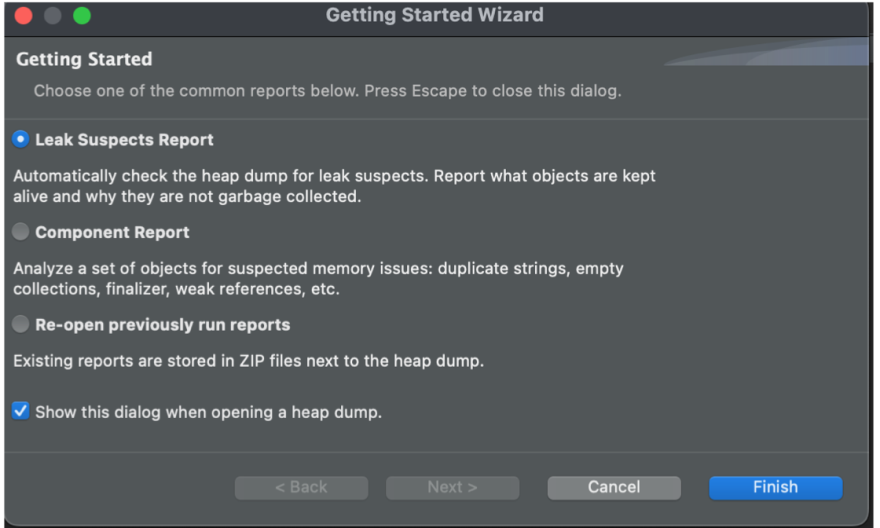

## mat 的安装

mat 下载地址: https://eclipse.dev/mat/previousReleases.php

以 Mac 系统为例，如果你使用的是 `Java8`，可以选用 `1.11.0 Release`。安装完后，先打开一下，可能会报错。
这时退出程序，修改程序包中两个文件， 应用程序 -> mat -> 右击显示包内容

::: info 修改程序包中以下文件

**Info.plist：** 配置正确的JDK地址，例如：
 `<string>/Library/Java/JavaVirtualMachines/jdk1.8.0_131.jdk/Contents/Home/bin/java</string>`

**MemoryAnalyzer.ini：** 如果待分析的 dump 文件很大，需要适当调大里面的 `-Xmx` 参数

:::

## mat 的使用

打开一个 dump 文件，弹框中记得勾选 **`Leak Suspects Report`**

